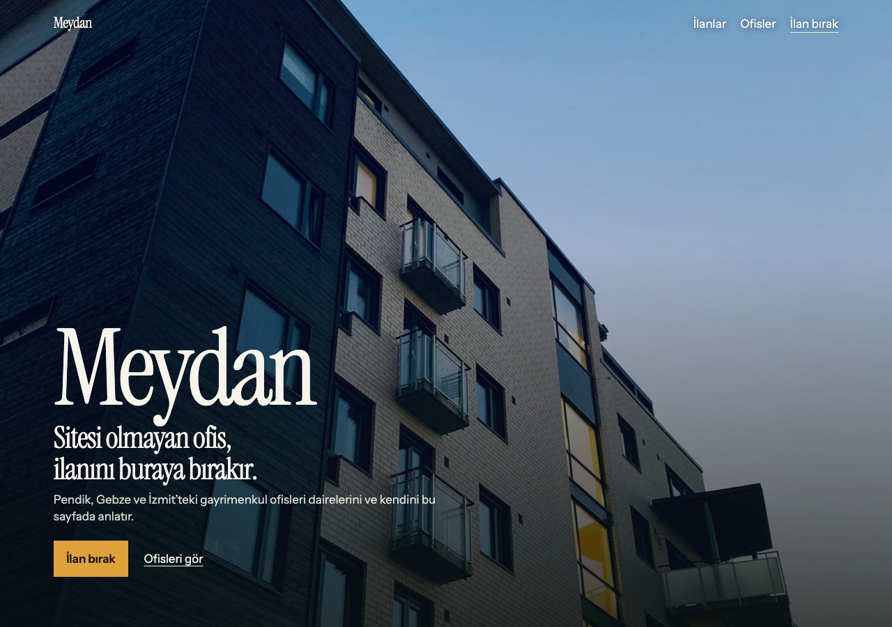
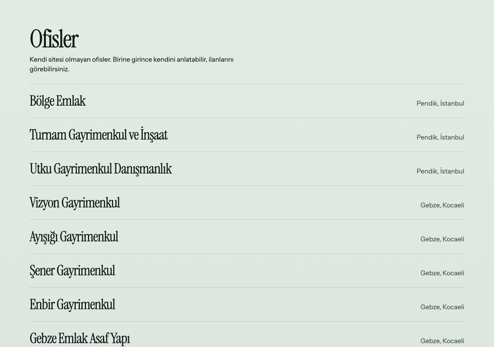
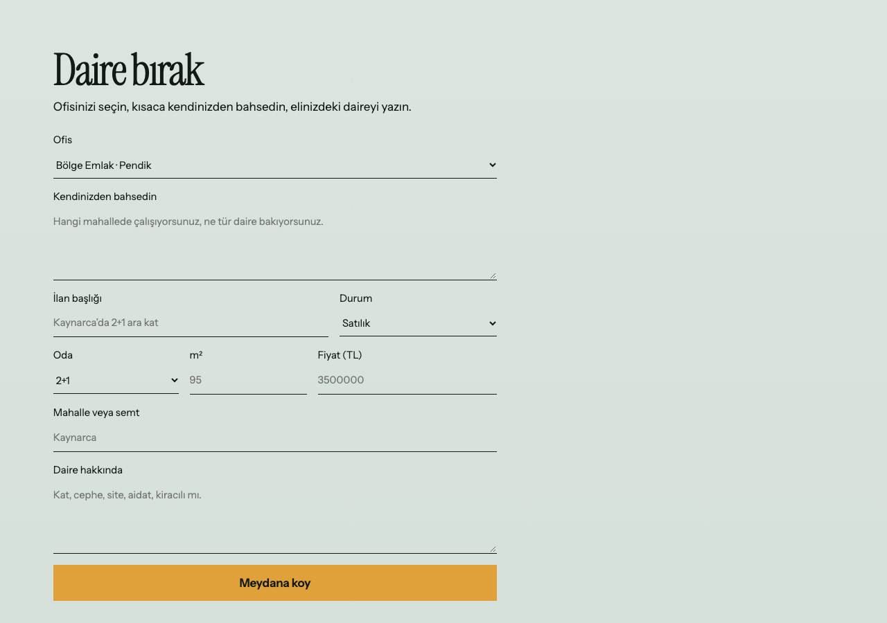

# Meydan

Sitesi olmayan ofislerin ortak ilan yeri. Pendik, Gebze ve İzmit’teki ofisler kendini anlatır, satılık veya kiralık daire bırakır.







## Kurulum

Tek klasör, üç dosya.

```bash
cd meydan-emlak
python3 -m http.server 8080
```

Aç: http://127.0.0.1:8080

Sayfa içi bağlantılar `#ilanlar`, `#ofisler` ve `#ilan-ver` bölümlerine iner.

## Nasıl kuruldu

Tek **HTML** sayfası, `styles.css` ve `app.js`. Yazı tipleri **Instrument Serif** ve **Instrument Sans**. Ofis listesi ve ilanlar betiğin içindeki veriden çizilir. Şehir süzgeci İstanbul ve Kocaeli’yi ayırır. Form ofis, başlık, satılık veya kiralık, oda, metrekare, fiyat ve mahalle ister.
